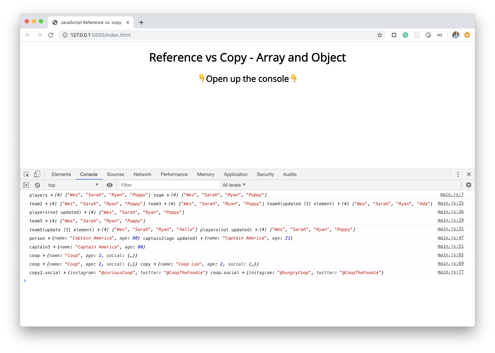

# 14. JS Reference vs Copy

#### _JS Reference vs Copy by JavaScript30 10/16/19_

## Description
This is demo of JS Reference vs Copy, 14th application out of 30 by 30 day Vanilla JavaScript Coding Challenge by Wes Bos.<br>
Please check the challenge from [JavaScript30](http://wesbos.com/javascript30/).




## About this Application:
Showing the difference between reference and copy
1. Array
    - reference the original array vs copy with `.slice()`, `.concat()`, spread operator (`...`) and `Array.from()`.

2. Object
    - reference the original object vs copy with `Object.assign()`, spread operator(`...`),
    - Check `Object.assign()` only works for one level. Use `JSON.parse(JSON.stringify())` for whole levels.
    

## Setup/Installation Requirements

1. Clone this repo:
```
$ git clone https://github.com/misakimichy/JS30-14-js-reference-vs-copy.git
```

2. Navigate to the top level of the cloned directory.

3. Open `index.html` with your preferred web browser.

4. Open the console on your browser.

5. Please check both the `main.js` and console.

## Known Bugs
* No known bugs at this time.

## Support and contact details
 I welcome any feedbacks and comments: misaki.koonce@gmail.com

## Technologies Used
_Git, GitHub, HTML, CSS, Vanilla JavaScript

## License
Copyright © 2019 under the MIT License